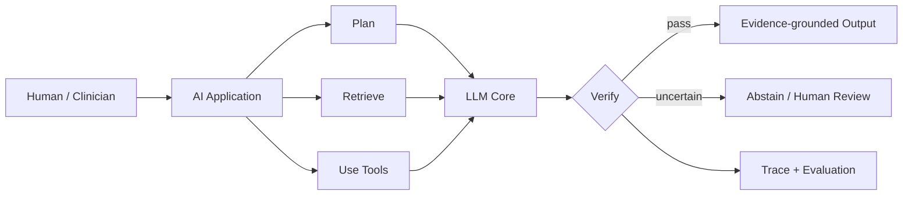
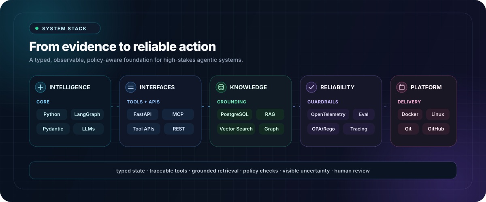

<div align="center">



<br/>

<a href="https://github.com/Molahassani"></a>
<a href="https://www.linkedin.com/in/mr-molahassani"></a>
<a href="https://orcid.org/0000-0001-9645-2607"></a>
<a href="http://www.mrmollahasani.ir/"></a>

<br/><br/>

**Medical Student · AI Systems Builder · Researcher**  
Building reliable AI that can **reason, retrieve evidence, use tools, verify, and explain**.

</div>

---

## Currently Building

<table>
<tr>
<td width="68%" valign="top">

### 🛡️ IMMUNIS-X

**Portable Counterfactual Immunization for Heterogeneous LLM Agent Systems**

A reliability layer that learns from agent failures, validates structural repairs, and safely transfers them across different agent architectures.

```text
observe → replay → localize → repair → validate → transfer
```

</td>
<td width="32%" valign="top">

**Status**  
`Active development`

**Focus**  
`Agent reliability`  
`Counterfactual replay`  
`Safe transfer`  
`Typed interventions`

**Stack**  
`Python` `Pydantic`  
`LangGraph` `OpenTelemetry`  
`Docker` `OPA/Rego`

</td>
</tr>
</table>

> First milestone: a deterministic **time-travel debugger for tool-using agents**.

---

## Featured Projects & Directions

<table>
<tr>
<td width="33%" valign="top">

### 🤖 Agentic Systems

Agents that plan, use tools, recover from failures, and verify their own execution.

`Building`

</td>
<td width="33%" valign="top">

### 🩺 Healthcare RAG

Evidence-grounded clinical AI with provenance, uncertainty, and human review.

`Research track`

</td>
<td width="33%" valign="top">

### 🔍 Explainable Clinical AI

Evaluating whether natural-language explanations are faithful, useful, and safe.

`Research interest`

</td>
</tr>
</table>

---

## Research

> **How can AI systems act in high-stakes environments while remaining inspectable, evidence-grounded, and uncertainty-aware?**

`Agent reliability` · `RAG & GraphRAG` · `Clinical NLP` · `Faithfulness` · `Calibration` · `Human oversight`

<details>
<summary><strong>Featured research question</strong></summary>
<br/>
Can large language models explain health-related predictions without producing explanations that are merely plausible?
<br/><br/>
Evaluation: <code>faithfulness</code> · <code>evidence alignment</code> · <code>uncertainty</code> · <code>clinical usefulness</code>
</details>

---

## Agentic AI



<div align="center">

`intent → plan → retrieve → act → validate → explain → learn`

</div>

---

## Technology Stack

<div align="center">



<br/>


<br/><br/>

`LangGraph` · `Pydantic` · `OpenTelemetry` · `MCP` · `OPA/Rego` · `Vector Search`

</div>

---

## GitHub Activity

<div align="center">


<br/>


</div>

---

<div align="center">

### Build systems, not demos.

**Prefer evidence over confidence · Make uncertainty visible · Keep humans in control**

<br/>

<a href="https://www.linkedin.com/in/mr-molahassani"></a>

<br/><br/>

<sub>Medicine × Agentic AI × Reliable Systems</sub>

</div>
