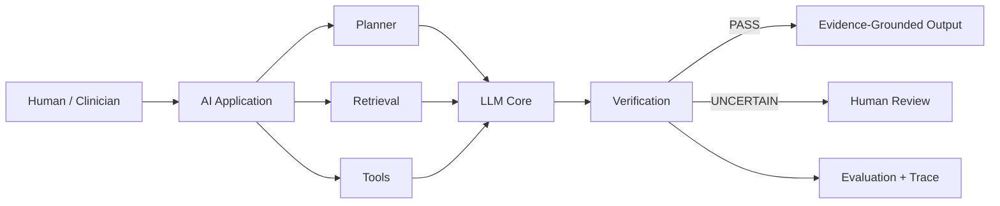

<div align="center">


<br/>

<a href="https://github.com/Molahassani">
  
</a>
<a href="https://www.linkedin.com/in/mr-molahassani">
  
</a>
<a href="https://orcid.org/0000-0001-9645-2607">
  
</a>
<a href="https://www.mrmollahasani.ir/">
  
</a>

<br/><br/>


</div>

---

## `01` — About

I'm **Mohammad Mahdi Molahassani** — a medical student and AI engineer working at the intersection of **medicine, agentic AI, reliable LLM systems, and healthcare**.

I am interested in building AI systems that go beyond generating fluent answers.

My focus is on systems that can:

```text
reason → retrieve evidence → use tools → verify actions → explain uncertainty
```

My work combines clinical perspective with hands-on engineering across:

**AI Agents · LLM Systems · RAG · Evaluation · Backend Engineering · Observability · Trustworthy AI**

<table>
<tr>
<td width="33%" valign="top">

### 🤖 Agentic AI

Tool-using agents, multi-step workflows, planning, memory, verification, evaluation, and reliability.

</td>

<td width="33%" valign="top">

### 🧬 Healthcare AI

Clinical NLP, evidence-grounded decision support, explainability, uncertainty, privacy, and human oversight.

</td>

<td width="33%" valign="top">

### ⚙️ AI Engineering

Production APIs, typed interfaces, orchestration, testing, observability, containers, and developer tooling.

</td>
</tr>
</table>

---

## `02` — Currently Building

### 🛡️ IMMUNIS-X

**Portable Counterfactual Immunization for Heterogeneous LLM Agent Systems**

A research-oriented reliability layer designed to learn from agent failures, transform validated repairs into portable intervention capsules, and evaluate whether those interventions can safely protect other agents across different frameworks and tool graphs.

```text
observe
   ↓
replay
   ↓
localize
   ↓
repair
   ↓
validate
   ↓
transfer
   ↓
prevent recurrence
```

### Core Research Question

> **Can a structural repair learned from Agent A be transferred to Agent B without causing negative transfer — and can the system reliably abstain when transfer is unsafe?**

**Status**

`Active Development`

**Research Focus**

`Agent Reliability` · `Counterfactual Replay` · `Typed Interventions` · `Capability Graphs` · `Safe Transfer`

**Initial Stack**

`Python` · `Pydantic` · `LangGraph` · `OpenTelemetry` · `Docker` · `OPA/Rego`

> **First public milestone:** a deterministic time-travel debugger for tool-using agents.

---

## `03` — What I'm Exploring

| Track                 | Focus                                                                 | Status         |
| --------------------- | --------------------------------------------------------------------- | -------------- |
| 🛡️ **IMMUNIS-X**     | Portable, validated repair transfer across heterogeneous AI agents    | 🟣 Building    |
| 🧬 **Healthcare AI**  | Evidence-grounded clinical reasoning with provenance and uncertainty  | 🔵 Research    |
| 🔗 **Agentic RAG**    | Agents that retrieve, act, validate, and recover                      | 🟢 Engineering |
| 🔍 **Explainable AI** | Faithfulness and clinical usefulness of natural-language explanations | 🟡 Research    |

---

## `04` — Research

My central research interest is:

> **How can we make AI systems reliable enough to operate in high-stakes environments while remaining inspectable, evidence-grounded, and uncertainty-aware?**

I am particularly interested in:

* **AI-agent reliability** — failure attribution, replay, repair, regression testing, and runtime safeguards
* **Agentic AI** — tool use, planning, memory, multi-agent coordination, and durable execution
* **Retrieval-grounded systems** — RAG, GraphRAG, provenance, citation fidelity, and knowledge integration
* **Healthcare AI** — clinical NLP, decision support, medical reasoning, privacy, and human oversight
* **Trustworthy AI** — calibration, abstention, robustness, interpretability, and evaluation
* **LLM systems engineering** — structured generation, typed tools, observability, testing, and model routing

### 🔬 Current Research Question

<details>
<summary><strong>Can LLMs explain health-related predictions in natural language without producing merely plausible explanations?</strong></summary>

<br/>

My research examines how natural-language explanations generated by large language models can be evaluated beyond fluency.

Key evaluation dimensions include:

`Faithfulness` · `Evidence Alignment` · `Uncertainty` · `Clinical Usefulness` · `Human Interpretability`

</details>

---

## `05` — The Systems I Want to Build



The goal is not simply:

```text
prompt → model → answer
```

It is:

```text
intent
  ↓
plan
  ↓
retrieve
  ↓
act
  ↓
validate
  ↓
explain
  ↓
learn
```

I am especially interested in systems where **evaluation, observability, verification, and uncertainty are part of the architecture — not afterthoughts.**

---

## `06` — Technology

<div align="center">

### AI & Agentic Systems


### Engineering


### Agent & Reliability Stack


</div>

---

## `07` — Engineering Radar

| Layer                 | Focus                                               |
| --------------------- | --------------------------------------------------- |
| 🧠 **Models**         | LLM reasoning, structured outputs, model routing    |
| 📚 **Knowledge**      | RAG, vector search, GraphRAG, provenance            |
| 🤖 **Agents**         | Planning, tool use, memory, verification            |
| 🛡️ **Reliability**   | Replay, evaluation, guardrails, regression testing  |
| ⚙️ **Backend**        | Python, FastAPI, typed APIs, asynchronous workflows |
| 🐳 **Infrastructure** | Docker, Linux, CI/CD, observability                 |
| 🧬 **Healthcare**     | Clinical NLP, explainability, privacy-aware AI      |

---

## `08` — GitHub Activity

<div align="center">


<br/>


</div>

> **Quality, reproducibility, and clear technical writing matter more to me than repository count.**

---

## `09` — Principles

```diff
+ Build systems, not demos.
+ Measure reliability, not just accuracy.
+ Prefer evidence over confident language.
+ Make uncertainty visible.
+ Treat evaluation as part of the product.
+ Keep humans in control of high-impact actions.
```

<br/>

<div align="center">

### Don't just build AI that answers.

### Build AI that can **inspect, verify, explain, and earn trust.**

</div>

---

## `10` — Connect

<div align="center">

I'm open to **research collaboration, open-source projects, and technical conversations** around:

**AI Agents · LLM Systems · Healthcare AI · RAG · Trustworthy AI · Software Engineering**

<br/>

<a href="https://www.linkedin.com/in/mr-molahassani">
  
</a>

<a href="https://orcid.org/0000-0001-9645-2607">
  
</a>

<a href="https://www.mrmollahasani.ir/">
  
</a>

<br/><br/>

### Medicine × Agentic AI × Reliable Systems

<sub>Building intelligent systems for environments where trust matters.</sub>

</div>
